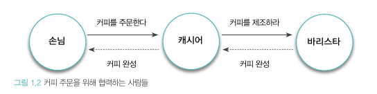

# 객체지향의 사실과 오해 : PART 1 - 조영호

## 01. 협력하는 객체들의 공동체

'객체 지향은 실세계를 직접적이고 직관적으로 모델링할 수 있는 패러다임' 이라는 설명에 마주하지만 객체지향 애플리케이션은 실세계를 모방하는 것이 아닌 새로운 세계를 창조하는 것이다. 

소프트웨어 객체가 상태와 행위를 캡슐화하여 자율성을 갖고, 메시지를 주고받으며 협락하는 객체들의 관계를 설명하기 위해 실세계를 모방한다는 설명을 하는 것이지, **실세계를 모방하는 것과 객체지향은 같지 않으며, 오해의 소지가 있는 사실**이다. 

### 개요

본문은 객체지향을 설명할 때에 왜 실세계를 모방한다고 언급하는지를 설명하기 위해 커피숍의 업무 프로세스를 예시로 든다. 

우리는 실세계에서 업무를 수행할 때 **역할(손님, 캐시어, 바리스타)** 을 담당하여 맡은 바 각자 **책임(커피 주문, 커피 주문 전달, 커피 제조)**을 다하며 그 과정에서 서로 **협력(상호간 협력 프로세스)** 한다.

### 요청과 응답으로 구성된 협력

우리는 손님 → 캐시어 → 바리스타 순으로 **요청(request)** 하고, 주어진 책임을 다해 요청에 **응답 (response)** 한다. 결국 우리는 **서로의 요청과 응답을 통해 협력**하게 된다. 

### 역할과 책임

손님이 주문한 커피를 제조하기 위해 협력하는 과정 속 **'손님', '캐시어', '바리스타'** 라는 역할이 존재한다. 손님의 역할은 커피를 주문하는 임무를, 캐시어의 역할은 손님으로부터 주문을 받는, 바리스타의 역할은 주문한 커피를 제조해야할 **책임**이 있다.

각각의 역할들은 다른 역할에게 적합한 책임을 수행해야할 의무가 있다. 사람들이 협력을 위해 특정한 역할을 맡고, 역할에 적합한 책임을 수행한다는 사실은 몇가지 중요한 개념을 제시한다.

- **여러 사람이 동일한 역할을 수행할 수 있다 :** 각 역할을 수행하는 입장에서 본인의 역할, 즉 본인의 책임만 성실하게 이행할 수 있다면 그만이다.
- **역할은 대체 가능성을 의미한다 :** 손님 입장에서 캐시어는 대체 가능하다. 캐시어의 역할을 수행할 수 있는 사람이 다수라면 그 어떤 사람이 역할을 수행해도 문제가 되지 않는다.
- **책임을 수행하는 방법은 자율적으로 선택할 수 있다 :**  요청을 받은 사람들은 요청을 처리하는 방법을 자유롭게 선택할 수 있다. 동일한 요청을 받더라도 서로 다른 방식으로 응답할 수 있는 능력을 **다형성** 이라고 한다.
- **한 사람이 동시에 여러 역할을 수행할 수 있다 :** 캐시어와 바리스타는 개별적인 역할을 통해 협력하지만 한 사람이 둘의 역할을 동시에 수행하는 것도 가능하다.

### 역할, 책임, 협력

> **기능을 구현하기 위해 협력하는 객체들**
> 

앞에서 사람이라는 단어를 객체로, 에어전트의 요청을 메시지로, 에이전트가 요청을 처리하는 방법을 메소드로 바꾸면 대부분의 설명을 객체지향이라는 문맥으로 옮겨올 수 있다.

> **역할과 책임을 수행하며 협력하는 객체들**
>

사람들은 특정한 목표를 이루기 위해 서로 협력한다. 협력의 핵심은 특정한 책임을 수행하는 역할들 간의 연쇄적인 요청과 응답을 통해 목표를 달성한다는 것이다. 애플리케이션도 이와 유사하다. 다만 커피 주문이 아닌 애플리케이션의 기능으로 치환될 뿐이다. 

애플리케이션의 기능은 더 작은 책임으로 분할되고, 책임은 적절한 역할을 수행할  수 있는 객체에 의해 수행된다. 또한 객체들은 자신의 책임을 수행하는 도중에 다른 객체에게 도움을 요청하기도 한다.

결론적으로 시스템은 역할과 책임을 수행하는 객체로 분할되고 시스템의 기능은 객체 간의 연쇄적인 요청과 응답의 흐름으로 구성된 협력으로 구현된다.

객체지향은 적절한 객체에게 적절한 책임을 할당하는 것에서 시작되고, 책임은 객체지향 설계의 품질을 결정하는 가장 중요한 요소이다.

### 협력 속에 사는 객체

객체지향 애플리케이션의 아름다움을 결정하는 것이 협력이라면, 협력이 얼마나 조화를 이루는지를 결정하는 것은 객체다. 즉, 협력의 품질을 결정하는 것은 객체의 품질이다.

- 객체가 갖춰야할 두 가지 덕목
    1. 객체는 충분히 '**협력적'**이어야한다.
        1. 외부의 도움을 무시하고 모든 것을 스스로 처리하는 God Object는 내부적인 복잡도로 인해 자멸한다.
    2. 객체는 충분히 '**자율적**'이어야한다.
        1. 다른 객체와 조화롭게 협력할 수 있을 만큼 충분히 개방적인 동시에 협력에 참여하는 방법을 스스로 결정할 수 있을 만큼 충분히 자율적인 객체들의 공동체를 설계하는 데 있다.흔히 객체를 **상태(state)**와 **행동(behavior)**을 함께 지닌 실체라고 정의한다. 객체가 협력에 참여하는 과정 속에서 스스로 판단하고 스스로 결정하는 자율적인 존재로 남기 위해서는 필요한 행동과 상태를 함께 지니고 있어야 한다.

> **상태와 행동을 함께 지닌 자율적인 객체**
> 

흔히 객체를 **상태(state)**와 **행동(behavior)**을 함께 지닌 실체라고 정의한다. 객체가 협력에 참여하는 과정 속에서 스스로 판단하고 스스로 결정하는 자율적인 존재로 남기 위해서는 필요한 행동과 상태를 함께 지니고 있어야 한다.

> **협력과 메시지**
> 

객체지향 세계에서는 **메시지**만 사용하여 의사소통한다. 즉 협력을 위해 다른 객체에게 메시지를 전송하고 다른 객체로부터 메세지를 수신한다. 이 때 메시지를 전송하는 객체를 송신자(sender) , 메세지를 수신하는 객체를 수신자(receiver)라고 부른다.

> **메서드와 자율성**
> 

객체가 수신된 메시지를 처리하는 방법을 **메서드(method)** 라고 부른다. 메시지와 메서드의 분리는 객체의 협력에 참여하는 객체들 간의 자율성을 증진시킨다. 위의 예시를 다시 인용하자면 바리스타로 전달된 커피 제조 요청이 **메시지** 이고, 커피를 제조하는 구체적인 방법이 **메서드**다. 

### 객체지향의 본질

- 객체지향이란 시스템을 상호작용하는 **자율적인 객체들의 공동체**로 바라보고 객체를 이용해 시스템을 분할하는 방법이다.
- 자율적인 객체란 **상태**와 **행위**를 함께 지니며 스스로 자기 자신을 책임지는 객체를 의미한다.
- 객체는 시스템의 행위를 구현하기 위해 다른 객체와 **협력**한다. 각 객체는 협력 내에서 정해진 **역할**을 수행하며 역할을 관련된 **책임**의 집합이다.
- 객체는 다른 객체와 협력하기 위해 메시지를 전송하고, **메시지**를 수신한 객체는 메시지를 처리하는 데에 적합한 **메서드**를 자율적으로 선택한다.

객체지향의 본질은 객체였다. 하지만 오랜 시간동안 클래스에 대한 중요성이 과하게 강조되어 사람들은 객체지향의 중심에 있는 객체가 아닌  클래스에 집중했다. 클래스가 객체지향 프로그래밍 언어의 관점에서 매우 중요한 구성요소인 것은 분명하지만, 객체지향의 핵심을 이루는 중심 개념이라고 말하기에는 무리가 있다. 

클래스를 지나치게 강조하는 것은 객체의 캡슐화를 저해하고 클래스를 서로 강하게 결합시킨다. 애플리케이션을 협력하는 객체들의 공동체가 아닌 클래스로 구성된 설계도로 보는 관점은 유연하고 확장 가능한 애플리케이션의 구축을 방해한다. 

코드를 담는 클래스의 관점에서 메시지를 주고받는 객체의 관점으로 사고의 중심을 전환하는 것이 중요하다. 중요한 것은 어떤 클래스가  필요한가가 아니라 어떤 객체들이 어떤 메시지를 주고받으며 협력하는가다.

클래스의 구조와 메서드가 아니라 객체의 역할, 책임, 협력에 집중하라. 객체지향은 객체를 지향하는 것이지 클래스를 지향하는 것이 아니다.
