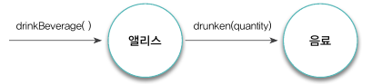

# 객체지향의 사실과 오해 : PART 2

> *객체지향 패러다임은 지식을 추상화하고 추상화한 지식을 객체 안에 캡슐화함으로써 실세계 문제에 내재된 복잡성을 관리하려고 한다. 객체를 발견하고 창조하는 것은 지식과 행동을 구조화하는 문제다.

- 레베카 워프스브록 (Rebecca Wirts-Brock)[Wirts-Brock 1990]*
> 

### 객체지향과 인지 능력

객체지향 패러다임의 목적은 현실 세계를 모방하는 것이 아니라 현실 세계를 기반으로 새로운 세계를 창조하는 것이다.

### 객체, 그리고 이상한 나라

앨리스(객체)의 키(상태)를 변화시키는 것은 앨리스의 **행동**('마셔라' 라고 인쇄된 병속의 음료를 마시거나 토끼가 떨어뜨린 부채로 부채질을 하거나)이다.

앨리스의 상태를 결정하는 것은 행동이지만 행동의 결과를 결정하는 것은 상태다. 앨리스가 병속의 음료를 마시고 150cm 가 커졌을 때 앨리스의 키가 30cm일때의 결과와 50cm일때의 결과는 다르다. 따라서 앨리스가 한 행동의 결과는 앨리스의 상태에 의존적이다.

어떤 행동의 성공 여부는 이전에 어떤 행동들이 발생했는지에 영향을 받는다. 앨리스가 문을 통과하려면 먼저 키를 줄여야 한다. 이것은 행동간의 순서가 중요하다는 것을 의미한다.

또한 행동에 의해 앨리스의 상태(키)가 변경되더라도 앨리스가 앨리스라는 사실은 변하지 않는다. 즉 상태 변경과 무관하게 **유일한 존재로 식별 가능**하다.

- 앨리스는 상태를 가지며 상태는 변경 가능하다.
- 앨리스의 상태를 변경시키는 것은 앨리스의 행동이다.
    - 행동의 결과는 상태에 의존적이며 상태를 이용해 서술할 수 있다.
    - 행동의 순서가 결과에 영향을 미친다.
- 앨리스는 어떤 상태에 있더라도 유일하게 식별 가능하다.

### 객체, 그리고 소프트웨어 나라

하나의 개별적인 실체로 식별 가능한 물리적인 또는 개념적인 사물은 어떤 것이라도 객체가 될 수 있다. 객체의 다양한 특성을 효과적으로 설명하기 위해서는 **객체를 상태(state), 행동(behavior), 식별자(identity)를 지닌 실체로 보는 것이 가장 효과적**이다.

*객체란 식별 가능한 개체 또는 사물이다. 자동차처럼 만질 수 있는 구체적인 사물일 수도 있고, 시간처럼 추상적인 개념일 수 도 있다. 객체는 구별 가능한 식별자, 특징적인 행동, 변경 가능한 상태를 가진다. 소프트웨어 안에서 객체는 저장된 상태와 실행 가능한 코드를 통해 구현된다.*

> **상태**
> 
1.  왜 상태가 필요한가
    
    현실 세계에서 비행기를 타거나 혹은 자판기에서 원하는 음료를 선택하거나, 엘리베이터를 움직이려면 과거의 어떤 행동을 통해 이루어져야 한다. 항공권을 발권하거나, 자판기에 충분한 금액을 넣거나, 엘리베이터의 층수를 누르는 과거의 행동들이 필요하다는 것이다.
    
    즉, 모든 일들의 공통점은 어떤 행동의 결과는 과거에 어떤 행동들이 일어났었느냐에 의존한다는 것이다. 객체도 동일하다. 객체가 주변 환경과의 상호작용에 어떻게 반응하는가는 그 시점까지 **객체에 어떤 일이 발생했느냐**에 좌우된다.
    
    하지만 과거의 발생한 행동의 이력을 통해 현재 발생한 행동의 결과를 판단하는 방식은 복잡하고 번거로우며 이해하기 어렵다. 따라서 인간은 행도으이 과정과 결과를 기술하기 위해 **상태**라는 개념을 고안한 것이다. 
    
    비행기의 탑승 여부, 현재까지 투입된 금액의 상태, 엘리베이터의 입력된 층수값이라는 상태를 통해 행동의 결과를 쉽게 예측하며 설명할 수 있다. 우리는 위처럼 상태를 이용하여 현재를 기반으로 객체의 행동 방식을 이해할 수 있다.
    
2. 상태와 프로퍼티
    
    모든 것이 객체는 아니다. 항공권의 예약여부, 자판기에 투입된 금액, 엘리베이터에 입력된 층수는 객체가 아니다. 물론 객체를 통해 다른 객체의 상태를 표현하는 것도 가능하다.
    
    모든 객체의 상태는 단순한 값과 객체의 조합으로 표현할 수 있는데, 이때 객체의 상태를 구성하는 모든 특징을 통틀어 객체의 **프로퍼티(property)**라고 한다. 
    
    예를 들어 앨리스 예시에서 앨리스와 음료를 살펴보자. 앨리스는 문을 통과하기 위해 음료수를 마신 후 키가 줄어들어 정원으로 들어왔다. 이 때 앨리스에게는 음료수가 없다. 아마 정원에 들어가기 전에 놓고온 것으로 보인다. 
    
    이 때 앨리스는 정원으로 들어가기 전에는 음료(객체)를 들고 있었지만, 정원으로 들어온 이후는 음료가 사라졌다. 이 때 음료(객체) 와 앨리스(객체)가 연관이 있을 때 이 **둘의 의미 있는 연결을 링크(Link)**라고 한다. 객체와 객체 사이에는 링크가 존재해야만 요청을 보내고 받을 수 있다. 즉, 객체의 링크를 통해서만 메시지를 주고받을 수 있다.  이런 링크와 달리 객체를 구성하는 단순히 값은 **속성(attribute)**라고 한다. 
    
    객체는 자율적인 존재다. 따라서 객체는 다른 객체의 상태에 직접적으로 접근할 수도, 상태를 변경할 수도 없다. 그렇다면 음료수를 마시는 것으로 앨리스의 키는 어떻게 변한걸까? 음료수를 마셔서 변했다. 직접적으로 음료수가 앨리스의 키를 줄이는 것이 아니라 간접적으로 앨리스의 키를 줄어들게 했다. 즉, 행동은 다른 객체로 하여금 간접적으로 객체의 상태를 변경하는 것을 가능하게 한다.
    
> **행동**
> 
1.  상태와 행동
    1. 객체의 행동은 상태에 영향을 받는다.
    2. 객체의 행동은 상태를 변경시킨다.

2. 협력과 행동
    
    객체가 다른 객체와 협력하는 유일한 방법은 다른 객체에게 요청을 보내는 것이다. 객체는 메시지를 통해서만 의사소통하며 행동을 하도록 만드는 것은 외부로부터 수신한 메시지다.
    
    > *'행동'이란 외부의 요청 또는 수신된 메시지에 응답하기 위해 동작하고 반응하는 활동이다. 행동의 결과로 객체는 자신의 상태을 변경하거나 다른 객체에게 메시지를 전달할 수 있다. 객체는 행동을 통해 다른 객체와의 협력에 참여하므로 행동은 외부에 가시적이어야 한다.*
    > 
    
3. 상태 캡슐화
    
    객체지향의 세계에서는 현실과는 다르게 모든 객체는 자신의 상태를 스스로 관리하는 자율적인 존재다. 즉, 앨리스가 음료수를 마시며 키가 줄어들며 음료수가 양이 줄어들었을 때 앨리스의 키를 작게 만드는 것이 앨리스 자신이듯이, 음료수의 양을 줄이는 것도 음료수 자신이어야 한다.
    
    따라서 앨리스는 직접적으로 음료의 상태를 변경하지 못하고 대신 음료수에게 자신이 음료를 마셨다는 메시지를 통해 음료의 양을 줄여달라 요청한다. 또한 음료는 자신이 양을 줄일지 말지를 스스로 결정한다.
    
    앨리스와 음료 사이의 협력 관계는 아래와 같다
    
   
    
    이 때 앨리스에게 전달되는 메시지는 drinkBeverage() 이고 음료에게 전달되는 메시지는 drunken(quantity)다. 우리는 이 메시지를 보고 앨리스의 키가 줄어든다너가 음료의 양이 줄어든다는 상태 변경을 예상할 수 없다. 
    
    캡슐화의 의도는 이것이다. 앨리스에게 메시지를 전달하는 객체나 음료에게 메시지를 전달하는 앨리스 (송신자) 가 **메시지 수신자의 상태 변경에 대해서는 전혀 알지 못하도록** 하는 것이다.
    
    객체의 행동은 외부로부터 전달된 메시지가 유발하고 상태의 변경 여부는 객체 스스로 결정하며 객체에게 메시지를 전달하는 외부의 객체는 수신자의 상태 변경이 일어난다는 사실 조차 모른다. 
    
    이렇게 상태를 외부에 노출시키지 않고 행동을 경계로 캡슐화하는 것은 결과적으로 객체의 자율성을 높인다.

> **식별자**
> 
- 값의 경우 두 인스턴스의 상태가 같다면 두 인스턴스를 같은 것으로 판단한다. 값이 같은지에 대한 여부는 상태가 같은지를 이용해 판단한다. 이렇게 상태를 이용해 판단할 수 있는 성질을 **동등성(equality)** 이라고 한다.
- 객체는 시간에 따라 상태가 변경되며 상태가 같더라도 객체는 다를 수 있다. 따라서 식별자를 통해 구별이 가능한데, 이렇게 식별자를 기반으로 객체가 같은지를 판단할 수 있는 성질을 **동일성(identical)**이라고 한다.

### 기계로서의 객체

객체의 상태를 조회하는 작업을 **쿼리(query)**, 객체의 상태를 변경하는 작업을 **명령(command)**라고 한다.

### 행동이 상태를 결정한다

객체지향의 갓 입문할 때 조심해야하는 것은 상태를 중심으로 객체를 바라보는 것이다. 상태를 먼저 결정하고 행동을 나중에 결정하는 방법은 설계에 나쁜 영향을 끼친다.

객체지향 설계는 애플리케이션에 필요한 **협력을 생각**하고 협력에 참여하는 데 **필요한 행동을 생각**한 후 **행동을 수행할 객체를 선택**하는 방식으로 수행된다.

### 은유와 객체

> **두 번째 도시전설**
> 

객체지향이 현실 세계의 모방이라는 사실은 틀렸다. 중요한 것은 추상화라는 일이 현실 세계와 객체 세계, 둘다에 적용된다는 것이다. 물론 모방과 추상화라는 개념만으로는 현실 객체와 소프트웨어 객체 사이의 관계를 깔끔하게 설명하지 못한다.

> **의인화**
> 

소프트웨어 객체는 능동적이다. 앨리스를 예시로 들면 현실 세계의 트럼프 카드는 스스로 뒤집거나 말할수도 없지만, 소프트웨어 객체는 가능하다.

현실의 객체보다 더 많은 일을 할 수 있는 소프트웨어 객체의 특징을 의인화라고 한다.
