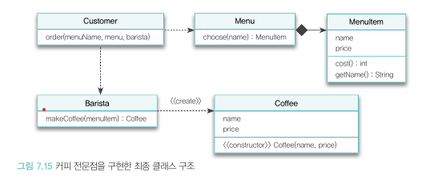
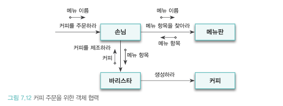
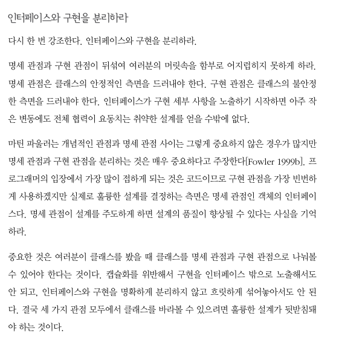

# 객체지향의 사실과 오해 PART 7 : 함께 모으기

### 개념, 명세, 구현 관점

본문 첫 시작은 마틴 파울러의 언급하는 객체지향 설계 안에 존재하는 세 가지 상호 연관된 관점에 대해 설명하며 시작한다. 각각 개념, 명세, 구현 관점이다. 

개념 관점의 설계는 실제 도메인의 규칙과 제약을 최대한 유사하게 반영하는 것이 핵심이다. 여기서 도메인은 사용자가 관심을 갖는 특정 분야나 주제로써 주로 은행 도메인, 배달 도메인 등등으로 세분화할 수 있다. 핵심은 실제 도메인의 규칙과 제약을 유사하게 반영하는 것이다. 

명세 관점에서는 사용자 영역인 도메인을 벗어나 소프트웨어로 초점을 옮긴다. 여기서부터 소프트웨어 안에 존재하는 객체들의 책임에 대해 바라보며, 객체가 협력을 위해 ‘무엇’을 할 수 있는가에 초점을 맞춘다. 우리는 항상 클래스와 객체를 분리해서 생각해야 한다. 하지만 이 단계에서 우린 인터페이스와 구현을 항상 분리하려 노력해야 한다. 명세 관점과 구현 관점은 반드시 명확하게 분리해야 한다. 

구현 관점은 우리가 흔히 작성하는 코드다. 간단하게 객체들이 책임을 수행하는 데에 필요한 동작하는 코드를 작성하는 것이다. 객체를 책임을 ‘어떻게’ 수행할 것인가에 초점을 맞춰 인터페이스를 구현하는데 필요한 속성과 메서드를 클래스에 추가한다. 

각 개념은 순서의 나열이 아닌 클래스를 바라보는 방향에 대한 설명이다. 클래스는 이 세 가지 관점을 모두 수용할 수 있도록 개념, 인터페이스, 구현을 함께 드러내야 하며, 이 셋이 쉽게 식별되도록 깔끔하게 분리되어야 한다.

---

### 커피 전문점 도메인
커피 전문점 도메인을 예시로 도메인 모델에서 최종 코드의 구현까지를, 각 세 가지 관점으로 클래스를 바라본다는 것이 무엇인지를 파악해보자.
> ***도메인 모델***
> 

아래는 도메인 모델의 구조이다. 손님, 메뉴판, 바리스타, 커피 객체로 구성되어 있으며 이들의 관계는 실선을 통해 명시되어있다. 사실 여기서 객체라고 명시된 것들은 ‘XX 타입'의 인스턴스로 볼 수 있다. 

> ***객체들의 인터페이스***
> 
각 객체들간의 인터페이스다. 여기서 우리가 하나 기억해야할 내용이 있다. 객체지향 설계는 훌륭한 객체가 아닌 훌륭한 협력을 설계하는 것이 중요했다. 그리고 협력을 설계할 때는 메시지가 객체를 선택하는 것이 필요했다. 즉 해당 책임을 수행하기 위한 메시지를 먼저 선택하고 수신하여 처리할 수 있는 객체를 선택해야 한다는 것이다. 자, 아래 그림을 보며 어떤 메시지(책임)이 어떤 객체에게 요청되는지를 확인해보자.

위 그림은 객체들의 인터페이스라고 말했다. 인터페이스란 리모콘의 음량 조절 버튼처럼 외부에 제공되는 버튼이다. 따라서 인터페이스를 사용하려면 내부에서 동작하는 오퍼레이션이 포함되어야 한다는 것을 말한다. 여기서 실선에 적혀진 문장들은 인터페이스이며 객체들은 해당 인터페이스에 대한 오퍼레이션들을 포함한다. 

대충 이해가 되는가? 이 인터페이스들을 시스템으로도 바꿀 수 있다. 땡타벅스라는 거대한 시스템에서 가장 첫번째로 들어온 요청이 바로 커피를 주문하는 것이다. 손님 객체에게 해당 요청이 할당되고 그 뒤로부터 커피 메뉴를 결저하기 위한 책임은 메뉴판, 제조하는 책임은 바리스타로 협력 관계가 쭉 이어져 나간다.

> ***클래스 구조***
> 

위 인터페이스를 클래스를 이용해 객체의 타입을 구현했다. 여기서 우린 객체들의 협력은 동적으로 묘사할 수 있지만 실제로 구현되는 소프트웨어는 정적인 타입을 이용해 이뤄진다는 것을 기억해야 한다. 따라서 객체들을 포괄하는 타입을 정의하고 위에서 정의한 오퍼레이션을 타입의 인터페이스에 추가하면 위 그림같은 결과물이 도출된다.

이를 코드로 바라볼 때 생기는 문제가 하나 있다. 과연 `Customer`가 어떻게 `Menu` 객체와 `Barista` 객체에 접근할 것이냐에 대한 것이다. 객체가 다른 객체에게 메시지를 전송하기 위해서는 먼저 객체에 대한 참조를 얻어야 하기 때문이다. 

따라서 우린 이 문제를 해결하기 위해 Customer 객체는 분명 둘에 대한 참조를 알도록 `order()` 메서드의 인자로 `Menu`와 `Barista` 객체를 전달받도록 설계했다. 이렇게 우린 구현을 하며 생각했던 인터페이스를 그대로 구현하진 못했다. 결국 설게 작업은 구현을 위한 밑그림일뿐 완벽한 구현 자체일 수 없다. 결국 우리는 코드를 작성해야 한다. 협력을 구상하는 단계예 너무 오랜 시간을 쏟기보단 최대한 빨리 구현을 통해 미비점을 찾는 것이 좋다.

---

### 코드와 세가지 관점

코드는 개념, 명세, 구현 관점 세가지를 모두 제공해야한다. 

*개념* 관점에서 우리가 작성한 클래스들은 커피 전문점 **도메인을 구성하는데 필요한 중요한 개념과 관계를 모두 반영**하고 있다는 것을 알 수 있다. 이를 통해 변경을 관리하기 쉽고 유지보수성을 향상시킬 수 있다. 소프트웨어 클래스와 도메인 클래스 사이의 간격이 좁으면 좁을수록 기능을 변경하기 위해 뒤적거려야 하는 코드의 양도 점점 줄어든다.

*명세* 관점은 클래스의 인터페이스를 바라본다. 인터페이스의 수정은 해당 객체와 협력하는 모든 객체에 영향을 끼칠 수 밖에 없다. 따라서 이는 수정하기가 어렵다. 따라서 최대한 변화에 안정적인 인터페이스를 설계하기 위해선 **구현과 관련된 세부 사항이 드러나지 않도록** 해야 한다. 

*구현* 관점은 클래스의 내부 구현을 바라본다. 클래스의 메서드와 속성은 구현에 속하며 공용 인터페이스(외부 객체와 협력하는)가 아니다. 따라서 이에 대한 변경은 외부에 객체에 영향을 끼쳐선 안된다(원칙적으로는 그렇지만 현실에서 100% 가능하진 않다). 

